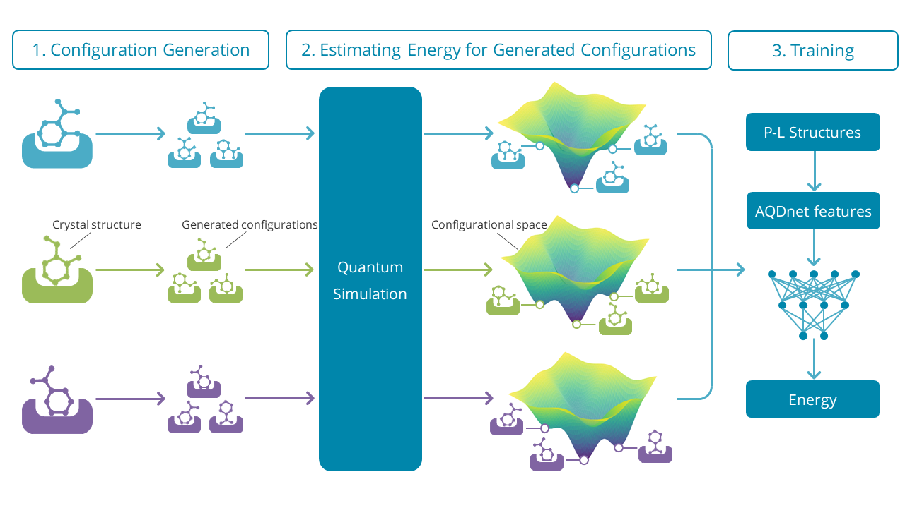

# AQDnet

AQDnet: Deep Neural Network for Protein-Ligand Docking Simulation.

## Script
* aqdnet.py
   * Code that provides an interface to AQDnet's feature extraction.
* lpcomp.py
   * Code containing AQDnet's algorithm for feature extraction.
* model.py
   * Code that provides an interface for training models with AQDnet features.
* structure.py
   * Code that specifies the structure of AQDnet's deep learning model and its accompanying preprocessing methods..
* runner.py
   * Code that includes some utility functions such as feature loading..
* predict.py
   * Code that provides an interface to make inferences using AQDnet's trained models.

## Examples
1. Ex1_generate_feature.ipynb
   * Feature generation example. 
2. Ex2_train_model.ipynb
   * Model training example.
3. Ex3_predict.ipynb
   * Prediction example.

## Models 
* Docking_Energy30RMSD2.5
  * Best model of AQDnet's Docking-specific model.
* Scoring_Energy02RMSD2.0
  * Best model of AQDnet's Scoring-specific model.

## Results
* Docking_Energy30RMSD2.5
  * Evaluation results of AQDnet's Docking-specific model with CASF-2016.
* Docking_AQDnet_summary.csv
  * Docking power test result of three different energy filtering conditions.
* Scoring_Energy02RMSD2.0
  * Evaluation results of AQDnet's Scoring-specific model with CASF-2016.
* ScoringPower_result.csv
  * the AQDnetet's result of Scoring power test and those of the other SFs.
* LIT-PCBA_result.csv
  * All tha result of the AQDnet's LIT-PCBA evaluation. EF1% of all template PDB ids are described.
* LIT-PCBA_result_summary.csv
  * Summarized LIT-PCBA result. Max, min, mean and SD of EF1% of all targets are descibed.

## Features
* Sample AQDnet features. Due to file size, only features for 5 complexes are available here.
   
## SampleStructures
Sample structures of 5 complexes.
