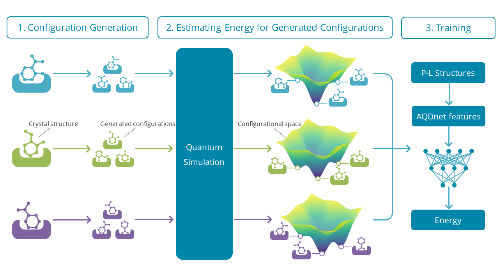
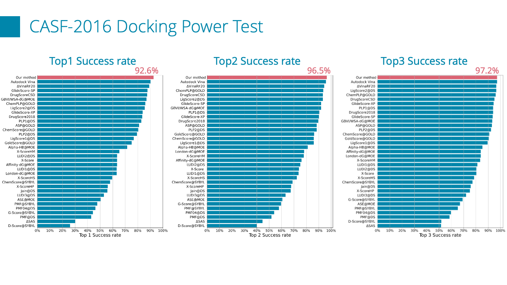
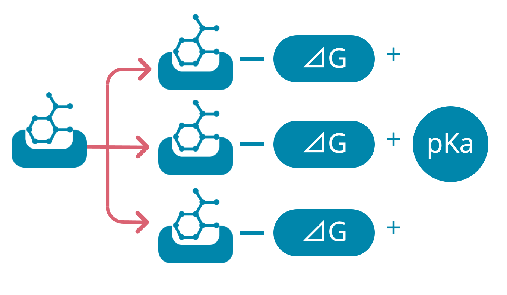
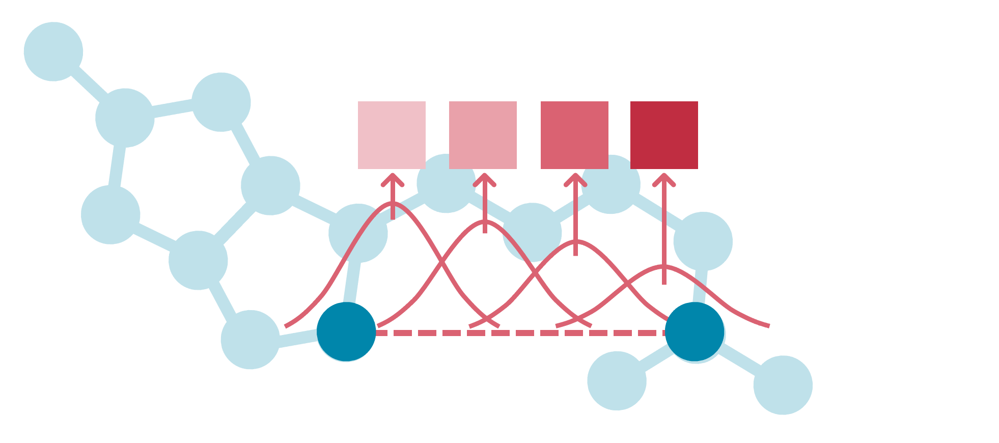
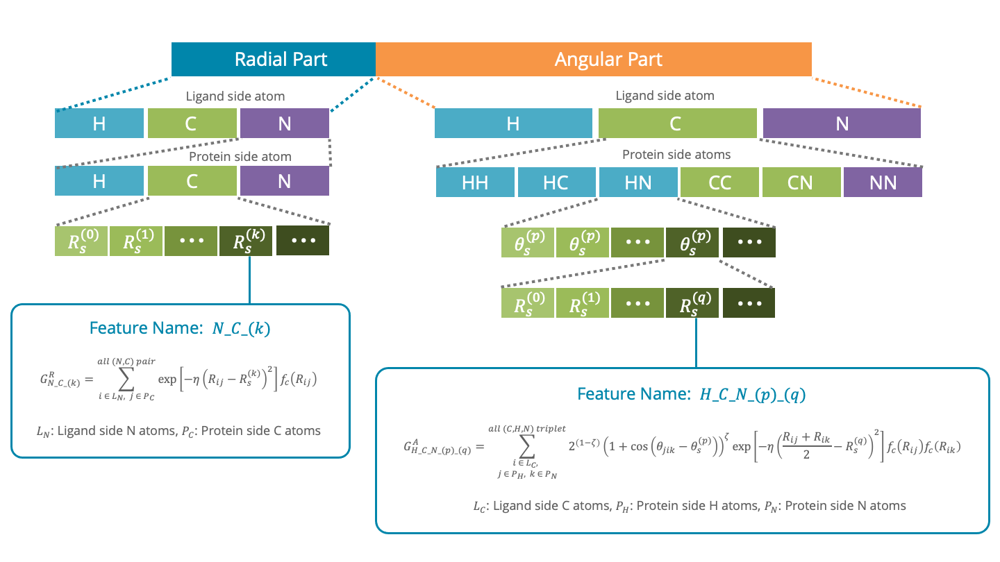
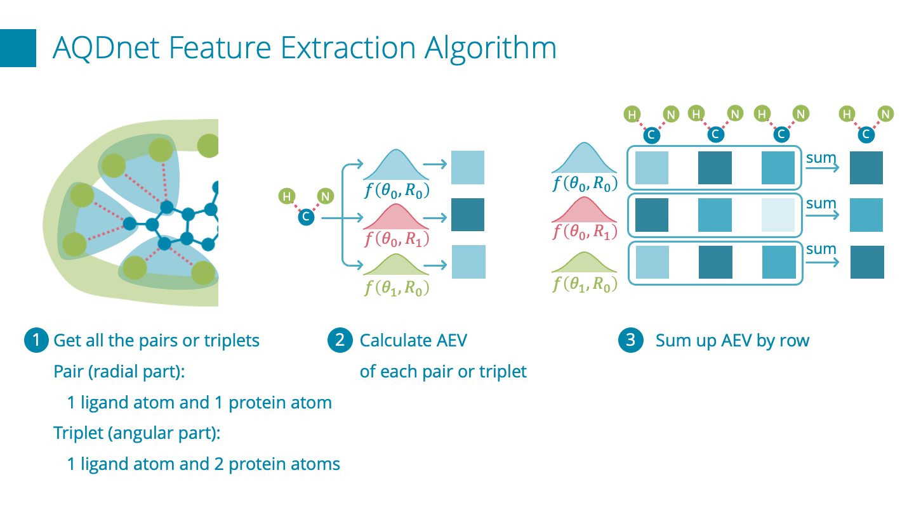
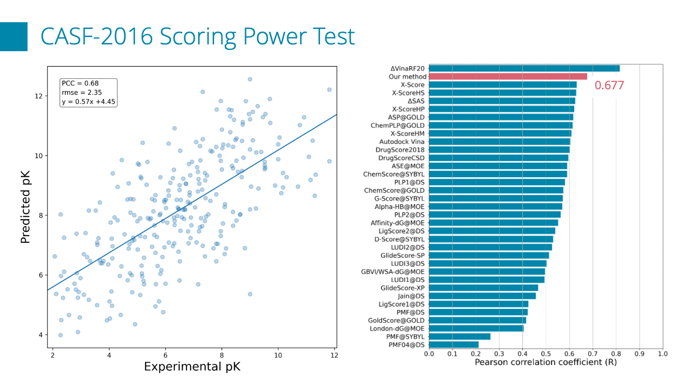

# AQDnet

**AQDnet: Deep Neural Network for Protein–Ligand Docking Simulation**

AQDnet is a deep neural network system for **protein–ligand docking and scoring**.  
It takes the **3D structure of a protein–ligand complex** as input and predicts a **binding affinity score** that can be used for docking pose evaluation and related scoring tasks.

This repository provides a research workflow for:

- structure preprocessing
- feature extraction
- model training
- prediction
- benchmark evaluation on CASF-2016



---

## Highlights

- **1st place in CASF-2016 docking power**
- **92.6% Top-1 success rate** in the CASF-2016 docking power benchmark
- Competitive performance in scoring and screening benchmarks
- Especially strong as a **docking-oriented pose selection model**




---

## What AQDnet Is

AQDnet is a method for predicting protein–ligand binding affinity from **3D complex structures**.

### Input
- A **protein–ligand complex structure**
- In this repository, the standard example format is a **PDB file containing both protein and ligand coordinates**

### Output
- A **predicted binding affinity score**
- Depending on the workflow, this score is used for:
  - docking pose selection
  - docking-oriented ranking
  - scoring-related evaluation

---

## Why AQDnet Is Scientifically Interesting

AQDnet was designed around two main ideas.

### 1. QM-labeled data augmentation

A key challenge in protein–ligand learning is the limited amount of high-quality labeled training data.  
AQDnet addresses this by generating many ligand configurations for each protein–ligand complex and assigning binding affinity labels through quantum-mechanics-based computation.

This makes it possible to learn from a much larger effective training set than would be available from crystal structures alone.




### 2. Fast ACSF-based tabular representation

Instead of using voxel grids or molecular graphs, AQDnet uses an **ACSF-inspired feature representation** for protein–ligand interactions.

This design was chosen to:

- capture fine geometric differences in atomic arrangements
- incorporate many-body interaction information
- enable efficient feature extraction and fast inference with a DNN

In other words, AQDnet is not just “a neural network for docking”; it is a system built around a specific representation strategy for the protein–ligand quantum energy landscape.




---

## What AQDnet Is Good At

AQDnet is strongest in **docking-oriented pose identification**.

In particular, this project should be understood as a model that is especially useful when the goal is:

- selecting the most plausible docking pose
- ranking candidate poses generated in docking workflows
- improving docking-oriented structure evaluation

---

## What AQDnet Is Not Best At

AQDnet is **not primarily positioned as the strongest cross-complex absolute affinity scoring model**.

Relative to newer graph-based or 3D CNN-based methods, its main strength is not state-of-the-art scoring power on idealized near-native structures, but rather its ability to work well in **docking-oriented settings**, where identifying the correct pose is critical.

That trade-off is important and should be stated explicitly.

---

## Design Note on Input Format

This repository uses a **single PDB file containing both protein and ligand** as input.

This choice had a practical advantage in the original research workflow:

- one file is enough to represent one docking pose
- preprocessing and feature extraction become simpler in a research setting

However, for real-world drug discovery workflows, a more user-friendly interface would often be:

- **protein structure as PDB**
- **ligand structure as SDF/mol**

That interface is generally more interoperable with standard cheminformatics and docking workflows.  
So while the single-PDB design was reasonable for the original research prototype, it is not necessarily the most production-friendly interface.

---

## Repository Structure

```text
AQDnet/
├── README.md                          # This file
├── environment/                       # Docker & dependency files
│   ├── Dockerfile                     # Container specification
│   ├── environment.yml                # Conda environment specification
│   └── requirements.txt               # Pip dependency list
├── scripts/                           # Core implementation
│   ├── aqdnet.py                      # Feature extraction interface
│   ├── lpcomp.py                      # Ligand-protein complex utilities
│   ├── model.py                       # Model training interface
│   ├── structure.py                   # DNN architecture definitions
│   ├── runner.py                      # Utility functions (loading, I/O)
│   ├── predict.py                     # Inference interface
│   ├── CASF2016.py                    # CASF-2016 evaluation
│   ├── preppdb.py                     # PDB structure preparation
│   ├── util.py                        # Helper utilities
│   └── visualize.py                   # Result visualization
├── features/                          # Extracted feature files
│   ├── feature_trainset_*.csv         # Training set features (10 shards)
│   ├── feature_validset_*.csv         # Validation set features (10 shards)
│   ├── label_{trainset,validset}.csv  # Binding affinity labels
│   └── *.tfrecords                    # TensorFlow record format
├── models/                            # Trained model checkpoints
│   ├── Docking_Energy30RMSD2.5/       # Docking-specific model
│   └── Scoring_Energy02RMSD2.0/       # Scoring-specific model
├── results/                           # Evaluation results
│   ├── CASF2016_Docking_Energy30RMSD2.5/
│   ├── CASF2016_Scoring_Energy02RMSD2.0/
│   ├── LIT-PCBA_result*.csv
│   ├── ScoringPower_result.csv
│   └── Docking_AQDnet_summary.csv
├── sample_structures/                 # Example PDB complexes
│   ├── 184l/, 185l/, 186l/, 187l/, 188l/
│   └── predict_example/
├── 01_generate_features.ipynb         # Feature extraction example
├── 02_train_model.ipynb               # Model training example
├── 03_predict_model.ipynb             # Prediction example
└── images/SchematicAbstract.png       # Research schematic
```

---

## Installation

### Option 1: Docker (Recommended)

All dependencies are pre-installed in the provided Docker image:

```bash
docker run --rm -it \
  -v "$PWD":/workspace \
  -w /workspace \
  koji11235/aqdnet_env:v0.1.0 \
  bash
```

### Option 2: Local Environment

```bash
# Create conda environment
conda env create -f environment/environment.yml
conda activate aqdnet

# Or via pip
pip install -r environment/requirements.txt
```

Environment files are kept under `environment/` to separate runtime setup from
the research code and benchmark artifacts in the repository root.

**Requirements**
- Python 3.6+
- TensorFlow 2.3.2
- RDKit
- Dask
- Pandas, NumPy

---

## Quick Start

### 1. Verify Installation

```bash
python -m aqdnet_cli --help
```

### 2. Generate Features from Sample Structures

Use the model-matched feature-generation parameters by default so the generated
features are compatible with the downstream prediction model:

```bash
python -m aqdnet_cli featurize \
  --input sample_structures/predict_example \
  --feature-param-file models/Docking_Energy30RMSD2.5/params_for_predict.json \
  --output predict_features.csv
```

One-line Docker example:

```bash
docker run --rm -it -v "$PWD":/workspace -w /workspace koji11235/aqdnet_env:v0.1.0 bash -lc 'python -m aqdnet_cli featurize --input sample_structures/predict_example --feature-param-file models/Docking_Energy30RMSD2.5/params_for_predict.json --output predict_features.csv --num-cpu 1'
```

Optional legacy-style usage:
for generic feature extraction without tying the output to a specific
prediction model, you can provide the ligand code directly:

```bash
python -m aqdnet_cli featurize \
  --input sample_structures \
  --output sample_features.csv \
  --ligand-code LGD
```

One-line Docker example:

```bash
docker run --rm -it -v "$PWD":/workspace -w /workspace koji11235/aqdnet_env:v0.1.0 bash -lc 'python -m aqdnet_cli featurize --input sample_structures --output sample_features.csv --ligand-code LGD --num-cpu 1'
```

### 3. Make a Prediction

```bash
python -m aqdnet_cli predict \
  --model models/Docking_Energy30RMSD2.5/ \
  --features sample_structures/predict_example \
  --output predictions.csv
```

The prediction output includes both `input_path` and the predicted value, so
each row can be traced back to its source PDB file.

One-line Docker example:

```bash
docker run --rm -it -v "$PWD":/workspace -w /workspace koji11235/aqdnet_env:v0.1.0 bash -lc 'python -m aqdnet_cli predict --model models/Docking_Energy30RMSD2.5 --features sample_structures/predict_example --output predictions.csv --num-cpu 1 --cuda -1'
```

End-to-end one-line Docker example (`featurize` + `predict`):

```bash
docker run --rm -it -v "$PWD":/workspace -w /workspace koji11235/aqdnet_env:v0.1.0 bash -lc 'python -m aqdnet_cli featurize --input sample_structures/predict_example --feature-param-file models/Docking_Energy30RMSD2.5/params_for_predict.json --output /tmp/predict_features.csv --num-cpu 1 && python -m aqdnet_cli predict --model models/Docking_Energy30RMSD2.5 --features /tmp/predict_features.csv --output predictions.csv --cuda -1'
```

### 4. Training Workflow

```bash
python -m aqdnet_cli train \
  --features features/feature_trainset.tfrecords \
  --labels features/label_trainset.csv \
  --output-dir runs/example
```

This command is currently validation-only. It checks the requested paths and
creates the output directory, but it does not run model fitting.  
Use `02_train_model.ipynb` for actual model fitting and benchmark reproduction.

---


## Example Workflow

For a complete walkthrough, see the Jupyter notebooks:

1. **01_generate_features.ipynb**  
   Demonstrates feature extraction from PDB structures using the AQDnet algorithm.

2. **02_train_model.ipynb**  
   Shows model training on sample features and validation workflow.

3. **03_predict_model.ipynb**  
   Illustrates inference using trained models.

Each notebook is self-contained and runnable in the Docker environment.

---

## Workflow Overview

```text
┌─────────────────────────────────────────────────────────────┐
│                    AQDnet Workflow Pipeline                 │
└─────────────────────────────────────────────────────────────┘

INPUT DATA
   ↓
   └─ PDB Structures (sample_structures/)
   └─ Ligand & Protein Coordinates

   ↓ [Step 1: Feature Extraction]
   └─ scripts/aqdnet.py (FeatureGenerator)
   └─ scripts/lpcomp.py (Ligand-Protein Complex)
   └─ scripts/preppdb.py (Structure Prep)

   ↓ OUTPUT: features/
   ├─ feature_trainset_*.csv (10 shards)
   ├─ feature_validset_*.csv (10 shards)
   ├─ label_{trainset,validset}.csv
   └─ *.tfrecords (TensorFlow format)

   ↓ [Step 2: Model Training]
   └─ scripts/model.py (Model Training Interface)
   └─ scripts/structure.py (DNN Architecture)
   └─ scripts/runner.py (Training Loop)

   ↓ OUTPUT: models/
   ├─ Docking_Energy30RMSD2.5/ (Docking model)
   └─ Scoring_Energy02RMSD2.0/ (Scoring model)

   ↓ [Step 3: Prediction & Evaluation]
   └─ scripts/predict.py (Inference)
   └─ scripts/CASF2016.py (Benchmark Eval)
   └─ scripts/visualize.py (Result Viz)

   ↓ OUTPUT: results/
   ├─ CASF2016_Docking_Energy30RMSD2.5/
   ├─ CASF2016_Scoring_Energy02RMSD2.0/
   ├─ LIT-PCBA_result*.csv
   └─ ScoringPower_result.csv
```

**Entry Points**
- **Python CLI**: `python -m aqdnet_cli [command]`
- **Jupyter Notebooks**: `01_*.ipynb`, `02_*.ipynb`, `03_*.ipynb`
- **Docker Container**: `koji11235/aqdnet_env:v0.1.0`

---

## Feature Extraction Concept

AQDnet uses a handcrafted feature extraction process based on an ACSF-inspired representation of the protein–ligand complex.

This part is important because the feature representation is one of the core scientific ideas of the project.

The representation was designed to:

- preserve geometric sensitivity to small coordinate differences
- incorporate interaction information beyond simple two-body contacts
- remain invariant to rotation/translation and atom ordering
- support fast DNN-based inference once features are extracted






---

## Model Architecture

AQDnet uses a deep neural network trained on the extracted tabular features.

The model design should be read together with the feature extraction strategy:

- the feature extractor is responsible for encoding the 3D interaction geometry
- the DNN is responsible for learning the relationship between those features and docking/scoring-related labels

This architecture reflects a deliberate design choice:

- **feature engineering first**
- **compact neural model second**

rather than end-to-end graph learning.

That decision made sense for the original project goals, especially for fast experimentation and docking-oriented evaluation, even though later projects may prefer graph-based approaches for greater expressiveness.


---

## Results Summary

### CASF-2016
- **Docking Power**: AQDnet achieved particularly strong performance and is the main highlight of the project.
- **Scoring Power**: Reported in `results/CASF2016_Scoring_Energy02RMSD2.0/`
- **Ranking Power**: Reported in the corresponding result files





### LIT-PCBA
- **Virtual screening results** are summarized in:
  - `results/LIT-PCBA_result_summary.csv`
  - `results/LIT-PCBA_result.csv`

See the CSV files in `results/` for detailed metrics.

---

## Reproducibility

### What Is Reproducible
- Feature extraction from PDB structures
- Prediction on new structures
- Evaluation code for CASF-2016
- Research workflow demonstration through notebooks and provided artifacts

### What Requires External Files
- Full benchmark reproduction  
  → Requires complete benchmark datasets obtained separately
- Pretrained model weights  
  → `best_model.h5` files are hosted externally

---

## Known Limitations

1. **Legacy software stack**  
   The current implementation is based on an older TensorFlow / Python ecosystem.

2. **CUDA-era dependency assumptions**  
   GPU execution depends on older CUDA/cuDNN-compatible environments.

3. **Research-oriented input interface**  
   The current workflow uses a PDB complex input format that is convenient for research, but less user-friendly than a protein-PDB + ligand-SDF interface for practical deployment.

4. **Training workflow is notebook-centered**  
   The repository is best understood as a research codebase rather than a polished production training package.

---

## Artifact Note

### Model Weights

The trained model checkpoints are **too large for GitHub** and are hosted on Google Drive.

**Docking-specific model**
- `models/Docking_Energy30RMSD2.5/best_model.h5`
- [Download from Google Drive](https://drive.google.com/drive/folders/1i9p5FpYisXrYICDraLmpMztvfA5Zn_-j?usp=share_link)

**Scoring-specific model**
- `models/Scoring_Energy02RMSD2.0/best_model.h5`
- [Download from Google Drive](https://drive.google.com/drive/folders/1i9p5FpYisXrYICDraLmpMztvfA5Zn_-j?usp=share_link)

### Why external storage?
- GitHub file size limits
- easier handling of large model artifacts

### Data Note
- All code is original
- Sample structures are derived from public PDB entries
- Benchmark datasets are public research datasets
- This repository contains no proprietary or confidential internal data

---

## Future Improvements

- [ ] Migrate to a modern TensorFlow / Python stack
- [ ] Add stronger type hints and automated tests
- [ ] Improve packaged CLI installation and documentation
- [ ] Provide a more practical production-style input interface (protein PDB + ligand SDF)

---

## License

MIT License. See [LICENSE](LICENSE) for details.

## Citation

If you use AQDnet in your research, please cite the original paper:

```bibtex
@article{shiota2023aqdnet,
  author = {Shiota, Koji and Suma, Akira and Ogawa, Hiroyuki and Yamaguchi, Takuya and Iida, Akio and Hata, Takahiro and Matsushita, Mutsuyoshi and Akutsu, Tatsuya and Tateno, Masaru},
  title = {AQDnet: Deep Neural Network for Protein–Ligand Docking Simulation},
  journal = {ACS Omega},
  year = {2023},
  volume = {8},
  number = {26},
  pages = {23925--23935},
  doi = {10.1021/acsomega.3c02411}
}
```
